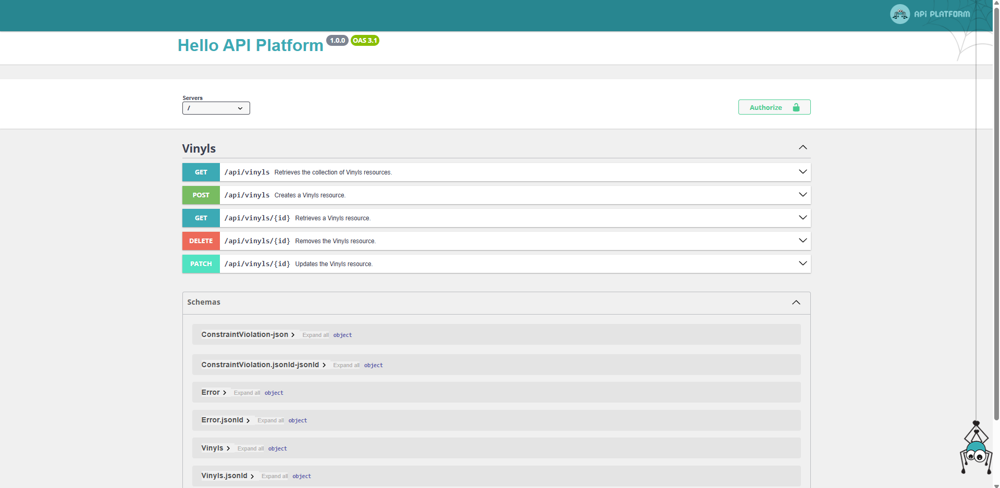

# Api created with Symfony

> This is the first version of api-vinyls-2000. It is being developed to be added to another project which will be a website with the best vinyls of the 2000s.

### Steps I have followed

1. I have created a new symfony project.
2. Using composer I have installed apiPlatform.
3. I have created the vinyl entity to represent the database.
4. Then I created a repository extending ServiceEntityRepository.
5. I have configured the .env file connecting the database.
6. I have created the database from the root of my project with the following cmd : 
`php bin/console doctrine:create:database`
7. I generate the migration for the database:  
`php bin/console make:migration`
8. I perform the migration to the database: 
`php bin/console doctrine:migrations:migrate`

 

*At this point I already had my symfony project connected to the database and I could start it up by running the following cmd:*

`symfony serve`

## Welcome Symfony

**add in the url /api**

`http://127.0.0.1:8000/api`

## Hello apiPlatform

*From this platform you can make post requests and then retrieve them with get*

*And finally i got my vinyls in json response*

### Updates

